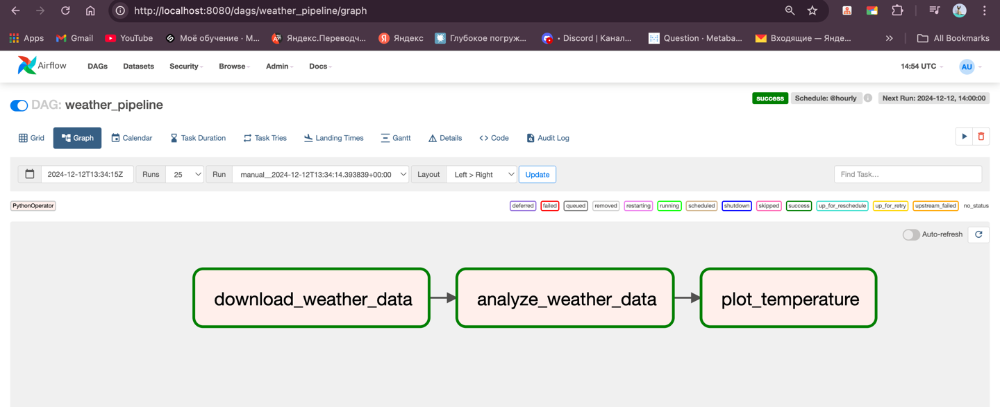
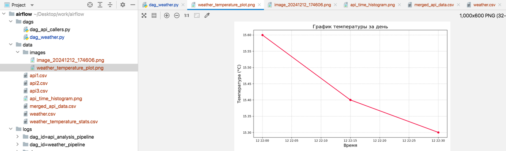
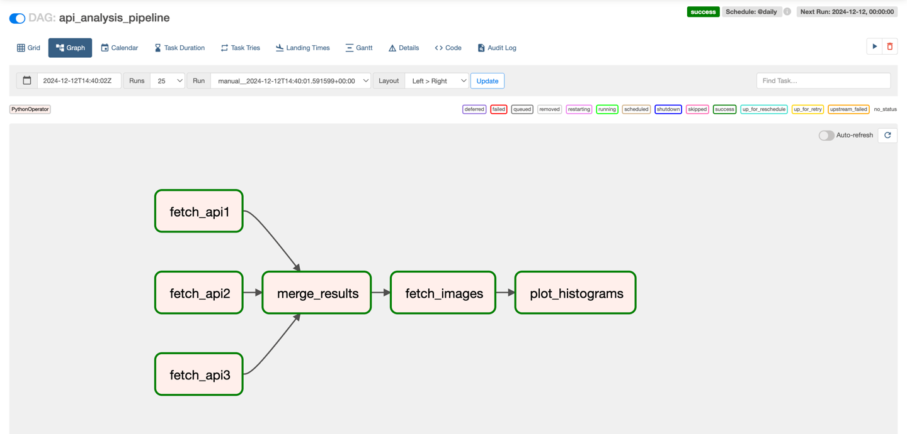
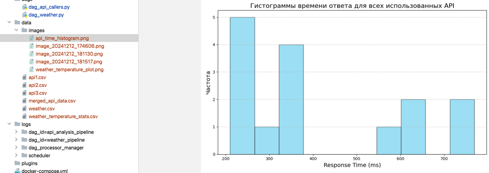
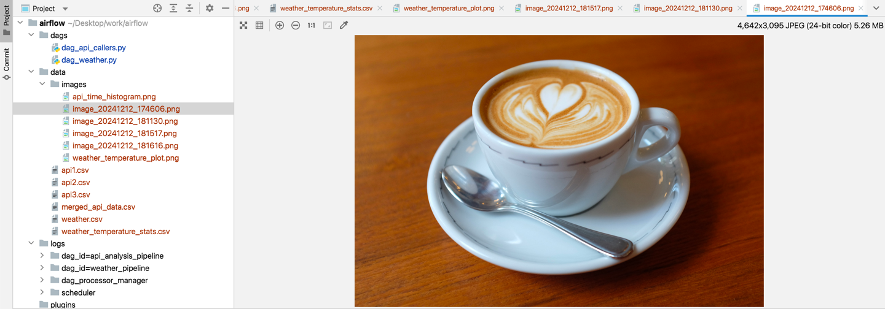

# Инструкция по запуску проекта

- приложение собирается внутри докер образа чтобы не создавать доп виртуальных окружений и обеспечивать изоляцию
- докер демон должен быть включен

```bash
docker-compose up --build
```

веб интерфейс будет доступен через

```
http://localhost:8080
```

креды для входа в админку
```
login: admin
pwd: admin
```

## Описание пайплайнов
### **1. DAG 1, файл** `dag_weather.py` 
- собирает данные с АПИ `Open meteo`
- анализирует `dataset describe` and save to `weather_stats.csv`
- строит графики `data/temperature_plot.png`

**1.1. DAG 1 pipeline view**



**1.2. График температуры за день**



**1.3. Weather stats**

`data/weather_temperature_stats.csv`
```csv
current_temperature_2m
count,8.0
mean,15.2625
std,0.1922609833384969
min,15.1
25%,15.1
50%,15.2
75%,15.4
max,15.6
```

----

### **2. DAG 2, файл** `dag_api_callers.py` 
- calls 3 different public APIs, 
- calls 1 API for download image (coffee.img, once if even day)
- merge data by request time field
- draw histogram

**2.1. DAG 2 pipeline view**



**2.2. Гистограмма времени ответа всех апи** 

(сделала по 5 реквестов чтобы rate limiter-ы не заблочили)
`data/images/api_time_histogram.png`



**2.3. Merged csv**
```
data/merged_api_data.csv
```

```csv
response,time,attempt
"{'thumb_url': 'https://photos.bandsintown.com/thumb/18404374.jpeg', 'mbid': '650e7db6-b795-4eb5-a702-5ea2fc46c848', 'facebook_page_url': 'http://www.facebook.com/10376464573', 'image_url': 'https://photos.bandsintown.com/large/18404374.jpeg', 'tracker_count': 6644471, 'tracking': [], 'upcoming_event_count': 0, 'url': 'https://www.bandsintown.com/a/22741?came_from=267&app_id=123123', 'support_url': '', 'show_multi_ticket': True, 'name': 'Lady Gaga', 'options': {'display_listen_unit': False}, 'links': [{'type': 'website', 'url': 'https://www.ladygaga.com/'}, {'type': 'other', 'url': 'http://www.hauslaboratories.com'}, {'type': 'amazon', 'url': 'https://music.amazon.com/artists/B0016SK9OW'}, {'type': 'shazam', 'url': 'https://www.shazam.com/artist/-/277293880'}, {'type': 'youtube', 'url': 'http://www.youtube.com/ladygagavevo'}, {'type': 'spotify', 'url': 'https://open.spotify.com/artist/1HY2Jd0NmPuamShAr6KMms'}, {'type': 'itunes', 'url': 'https://music.apple.com/artist/277293880'}, {'type': 'facebook', 'url': 'https://www.facebook.com/ladygaga/'}, {'type': 'twitter', 'url': 'http://twitter.com/ladygaga'}], 'artist_optin_show_phone_number': False, 'id': '22741'}",769,0
"{'thumb_url': 'https://photos.bandsintown.com/thumb/18404374.jpeg', 'mbid': '650e7db6-b795-4eb5-a702-5ea2fc46c848', 'facebook_page_url': 'http://www.facebook.com/10376464573', 'image_url': 'https://photos.bandsintown.com/large/18404374.jpeg', 'tracker_count': 6644471, 'tracking': [], 'upcoming_event_count': 0, 'url': 'https://www.bandsintown.com/a/22741?came_from=267&app_id=123123', 'support_url': '', 'show_multi_ticket': True, 'name': 'Lady Gaga', 'options': {'display_listen_unit': False}, 'links': [{'type': 'website', 'url': 'https://www.ladygaga.com/'}, {'type': 'other', 'url': 'http://www.hauslaboratories.com'}, {'type': 'amazon', 'url': 'https://music.amazon.com/artists/B0016SK9OW'}, {'type': 'shazam', 'url': 'https://www.shazam.com/artist/-/277293880'}, {'type': 'youtube', 'url': 'http://www.youtube.com/ladygagavevo'}, {'type': 'spotify', 'url': 'https://open.spotify.com/artist/1HY2Jd0NmPuamShAr6KMms'}, {'type': 'itunes', 'url': 'https://music.apple.com/artist/277293880'}, {'type': 'facebook', 'url': 'https://www.facebook.com/ladygaga/'}, {'type': 'twitter', 'url': 'http://twitter.com/ladygaga'}], 'artist_optin_show_phone_number': False, 'id': '22741'}",584,1
"{'thumb_url': 'https://photos.bandsintown.com/thumb/18404374.jpeg', 'mbid': '650e7db6-b795-4eb5-a702-5ea2fc46c848', 'facebook_page_url': 'http://www.facebook.com/10376464573', 'image_url': 'https://photos.bandsintown.com/large/18404374.jpeg', 'tracker_count': 6644471, 'tracking': [], 'upcoming_event_count': 0, 'url': 'https://www.bandsintown.com/a/22741?came_from=267&app_id=123123', 'support_url': '', 'show_multi_ticket': True, 'name': 'Lady Gaga', 'options': {'display_listen_unit': False}, 'links': [{'type': 'website', 'url': 'https://www.ladygaga.com/'}, {'type': 'other', 'url': 'http://www.hauslaboratories.com'}, {'type': 'amazon', 'url': 'https://music.amazon.com/artists/B0016SK9OW'}, {'type': 'shazam', 'url': 'https://www.shazam.com/artist/-/277293880'}, {'type': 'youtube', 'url': 'http://www.youtube.com/ladygagavevo'}, {'type': 'spotify', 'url': 'https://open.spotify.com/artist/1HY2Jd0NmPuamShAr6KMms'}, {'type': 'itunes', 'url': 'https://music.apple.com/artist/277293880'}, {'type': 'facebook', 'url': 'https://www.facebook.com/ladygaga/'}, {'type': 'twitter', 'url': 'http://twitter.com/ladygaga'}], 'artist_optin_show_phone_number': False, 'id': '22741'}",627,2
"{'thumb_url': 'https://photos.bandsintown.com/thumb/18404374.jpeg', 'mbid': '650e7db6-b795-4eb5-a702-5ea2fc46c848', 'facebook_page_url': 'http://www.facebook.com/10376464573', 'image_url': 'https://photos.bandsintown.com/large/18404374.jpeg', 'tracker_count': 6644471, 'tracking': [], 'upcoming_event_count': 0, 'url': 'https://www.bandsintown.com/a/22741?came_from=267&app_id=123123', 'support_url': '', 'show_multi_ticket': True, 'name': 'Lady Gaga', 'options': {'display_listen_unit': False}, 'links': [{'type': 'website', 'url': 'https://www.ladygaga.com/'}, {'type': 'other', 'url': 'http://www.hauslaboratories.com'}, {'type': 'amazon', 'url': 'https://music.amazon.com/artists/B0016SK9OW'}, {'type': 'shazam', 'url': 'https://www.shazam.com/artist/-/277293880'}, {'type': 'youtube', 'url': 'http://www.youtube.com/ladygagavevo'}, {'type': 'spotify', 'url': 'https://open.spotify.com/artist/1HY2Jd0NmPuamShAr6KMms'}, {'type': 'itunes', 'url': 'https://music.apple.com/artist/277293880'}, {'type': 'facebook', 'url': 'https://www.facebook.com/ladygaga/'}, {'type': 'twitter', 'url': 'http://twitter.com/ladygaga'}], 'artist_optin_show_phone_number': False, 'id': '22741'}",647,3
"{'thumb_url': 'https://photos.bandsintown.com/thumb/18404374.jpeg', 'mbid': '650e7db6-b795-4eb5-a702-5ea2fc46c848', 'facebook_page_url': 'http://www.facebook.com/10376464573', 'image_url': 'https://photos.bandsintown.com/large/18404374.jpeg', 'tracker_count': 6644471, 'tracking': [], 'upcoming_event_count': 0, 'url': 'https://www.bandsintown.com/a/22741?came_from=267&app_id=123123', 'support_url': '', 'show_multi_ticket': True, 'name': 'Lady Gaga', 'options': {'display_listen_unit': False}, 'links': [{'type': 'website', 'url': 'https://www.ladygaga.com/'}, {'type': 'other', 'url': 'http://www.hauslaboratories.com'}, {'type': 'amazon', 'url': 'https://music.amazon.com/artists/B0016SK9OW'}, {'type': 'shazam', 'url': 'https://www.shazam.com/artist/-/277293880'}, {'type': 'youtube', 'url': 'http://www.youtube.com/ladygagavevo'}, {'type': 'spotify', 'url': 'https://open.spotify.com/artist/1HY2Jd0NmPuamShAr6KMms'}, {'type': 'itunes', 'url': 'https://music.apple.com/artist/277293880'}, {'type': 'facebook', 'url': 'https://www.facebook.com/ladygaga/'}, {'type': 'twitter', 'url': 'http://twitter.com/ladygaga'}], 'artist_optin_show_phone_number': False, 'id': '22741'}",765,4
"{'categories': [], 'created_at': '2020-01-05 13:42:27.496799', 'icon_url': 'https://api.chucknorris.io/img/avatar/chuck-norris.png', 'id': '0rpfuvomTBK3njXdPd3B1w', 'updated_at': '2020-01-05 13:42:27.496799', 'url': 'https://api.chucknorris.io/jokes/0rpfuvomTBK3njXdPd3B1w', 'value': ""Chuck Norris doesn't text message with him fingers. He uses his nose.""}",371,0
"{'categories': [], 'created_at': '2020-01-05 13:42:23.880601', 'icon_url': 'https://api.chucknorris.io/img/avatar/chuck-norris.png', 'id': 'cQwhrrYHTFC8RMswJbOfbg', 'updated_at': '2020-01-05 13:42:23.880601', 'url': 'https://api.chucknorris.io/jokes/cQwhrrYHTFC8RMswJbOfbg', 'value': 'If you look up ""Chuck Norris naked""your face will explode after seeing the picture.'}",355,1
"{'categories': [], 'created_at': '2020-01-05 13:42:21.795084', 'icon_url': 'https://api.chucknorris.io/img/avatar/chuck-norris.png', 'id': 'LyoEMK7PQeGlQp4buih3WA', 'updated_at': '2020-01-05 13:42:21.795084', 'url': 'https://api.chucknorris.io/jokes/LyoEMK7PQeGlQp4buih3WA', 'value': 'Chuck Norris won the New York Marathon while steaming some crab legs in Austin, TX'}",330,2
"{'categories': [], 'created_at': '2020-01-05 13:42:23.880601', 'icon_url': 'https://api.chucknorris.io/img/avatar/chuck-norris.png', 'id': 'a92anp-4SVeQZxg-CmNhEA', 'updated_at': '2020-01-05 13:42:23.880601', 'url': 'https://api.chucknorris.io/jokes/a92anp-4SVeQZxg-CmNhEA', 'value': 'Chuck Norris can make a snowman out of raindrops.'}",236,3
"{'categories': [], 'created_at': '2020-01-05 13:42:29.296379', 'icon_url': 'https://api.chucknorris.io/img/avatar/chuck-norris.png', 'id': '0Au5UN3TRCuQAzP7FU0dNQ', 'updated_at': '2020-01-05 13:42:29.296379', 'url': 'https://api.chucknorris.io/jokes/0Au5UN3TRCuQAzP7FU0dNQ', 'value': 'Chuck Norris uses liquid nitrogen as mouthwash.'}",332,4
"{'latitude': 51.125, 'longitude': 71.0, 'generationtime_ms': 0.028014183044433594, 'utc_offset_seconds': 18000, 'timezone': 'Asia/Almaty', 'timezone_abbreviation': '+05', 'elevation': 368.0, 'current_units': {'time': 'iso8601', 'interval': 'seconds', 'temperature_2m': '°C', 'precipitation': 'mm', 'weather_code': 'wmo code', 'pressure_msl': 'hPa'}, 'current': {'time': '2024-12-12T23:00', 'interval': 900, 'temperature_2m': -11.2, 'precipitation': 0.0, 'weather_code': 3, 'pressure_msl': 1025.1}}",254,0
"{'latitude': 51.125, 'longitude': 71.0, 'generationtime_ms': 0.025987625122070312, 'utc_offset_seconds': 18000, 'timezone': 'Asia/Almaty', 'timezone_abbreviation': '+05', 'elevation': 368.0, 'current_units': {'time': 'iso8601', 'interval': 'seconds', 'temperature_2m': '°C', 'precipitation': 'mm', 'weather_code': 'wmo code', 'pressure_msl': 'hPa'}, 'current': {'time': '2024-12-12T23:00', 'interval': 900, 'temperature_2m': -11.2, 'precipitation': 0.0, 'weather_code': 3, 'pressure_msl': 1025.1}}",232,1
"{'latitude': 51.125, 'longitude': 71.0, 'generationtime_ms': 0.05710124969482422, 'utc_offset_seconds': 18000, 'timezone': 'Asia/Almaty', 'timezone_abbreviation': '+05', 'elevation': 368.0, 'current_units': {'time': 'iso8601', 'interval': 'seconds', 'temperature_2m': '°C', 'precipitation': 'mm', 'weather_code': 'wmo code', 'pressure_msl': 'hPa'}, 'current': {'time': '2024-12-12T23:00', 'interval': 900, 'temperature_2m': -11.2, 'precipitation': 0.0, 'weather_code': 3, 'pressure_msl': 1025.1}}",211,2
"{'latitude': 51.125, 'longitude': 71.0, 'generationtime_ms': 0.06198883056640625, 'utc_offset_seconds': 18000, 'timezone': 'Asia/Almaty', 'timezone_abbreviation': '+05', 'elevation': 368.0, 'current_units': {'time': 'iso8601', 'interval': 'seconds', 'temperature_2m': '°C', 'precipitation': 'mm', 'weather_code': 'wmo code', 'pressure_msl': 'hPa'}, 'current': {'time': '2024-12-12T23:00', 'interval': 900, 'temperature_2m': -11.2, 'precipitation': 0.0, 'weather_code': 3, 'pressure_msl': 1025.1}}",210,3
"{'latitude': 51.125, 'longitude': 71.0, 'generationtime_ms': 0.030040740966796875, 'utc_offset_seconds': 18000, 'timezone': 'Asia/Almaty', 'timezone_abbreviation': '+05', 'elevation': 368.0, 'current_units': {'time': 'iso8601', 'interval': 'seconds', 'temperature_2m': '°C', 'precipitation': 'mm', 'weather_code': 'wmo code', 'pressure_msl': 'hPa'}, 'current': {'time': '2024-12-12T23:00', 'interval': 900, 'temperature_2m': -11.2, 'precipitation': 0.0, 'weather_code': 3, 'pressure_msl': 1025.1}}",314,4
```

**2.4. Coffee image**
```
data/images/image_20241212_174606.png
```




## Список использованных публичных АПИ, curl-s

#### Open Meteo
```bash
curl --location 'https://api.open-meteo.com/v1/forecast?latitude=51.125&longitude=71&current=temperature_2m%2Cprecipitation%2Cweather_code%2Cpressure_msl&timezone=Asia%2FAlmaty'
```

#### Singer info
```bash
curl --location 'https://rest.bandsintown.com/artists/Lady%20Gaga?app_id=123123'
```

#### Chuck Norris jokes
```bash
curl --location 'https://api.chucknorris.io/jokes/random'
```

### rnd coffee images
```bash
curl --location 'https://coffee.alexflipnote.dev/random'
```